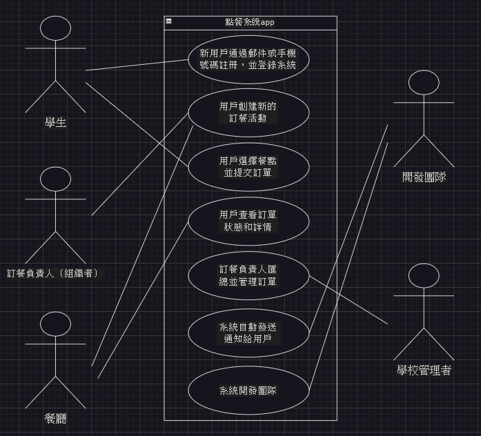
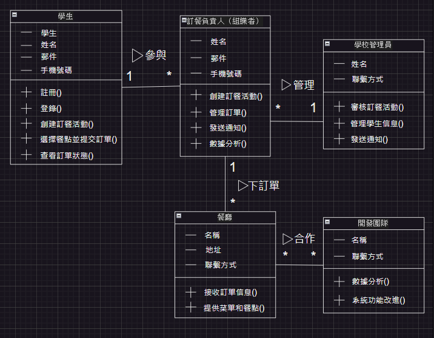
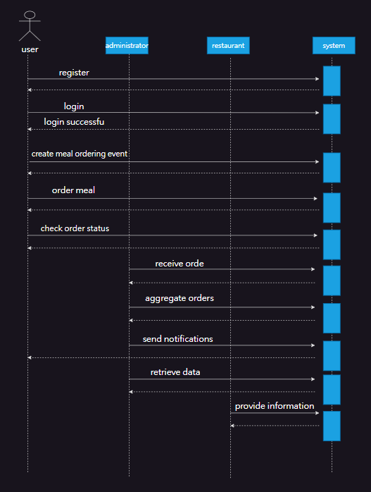

系統分析與設計期末專案111111203張紋綺 11111117林郁岑 
期末作業分配：

點餐系統app-敘述 
在大學生活中，我們經常會發生一起訂午餐的情況。以往，我們習慣使用LINE來發送訊息詢問大家想吃什麼，但LINE上廣告訊息眾多，很容易讓我們的訊息被掩蓋。這造成了訂餐計畫的混亂和延誤問題。為了解決這個困擾，我們需要一個更有效率、專注的溝通工具，讓每個人都能清晰表達訂餐意願，並能快速地統整訂單，提高整個訂餐流程的效率。

前台（用戶端）: 
用戶可郵件或手機號碼註冊登錄，創建活動時設置名稱、截止時間、備註，添加餐廳和菜單。用戶選擇餐點並填寫要求，系統提供截止時間和狀態通知，顯示訂單詳情和總價。管理端可管理用戶、訂單、活動和通知，提供數據分析功能。

後台（管理端）: 
可新增、修改、刪除用戶資料和活動，查看訂單歷史及偏好。訂單管理有審核、匯總、提交給餐廳，查看詳情和狀態。通知管理設置通知內容和時間，系統自動發送提醒和狀態變更。數據分析提供訂單統計和用戶偏好分析，優化菜單和服務。

| 利害關係人 | 目標  |
| ---------------- | -------------------------------------------------------- |
| 學生  | 1. 提供直觀操作界面，快速完成訂餐。 2. 確保隨時查看訂單狀態，避免混亂。 3. 集中管理訂餐信息，避免被其他訊息掩蓋。 |
| 訂餐負責人（組織者） | 1. 提供自動匯總和統計功能，簡化訂單管理。 2. 建立系統化訂單流程，保證準確性。 3. 直接與餐廳溝通，降低溝通成本。 |
| 餐廳 | 1. 確保收到準確訂單資訊，減少錯誤。 2. 提供自動匯總和直接提交功能，提升效率。 3. 增進訂餐流程效率和準確性，提高信任度。 |
| 開發團隊  | 1. 定期收集用戶反饋，改進系統功能。 2. 提供流暢操作界面，優化使用體驗。 3. 持續維護系統，保證穩定運行。 |
| 學校管理者 | 1. 確保快速便捷訂餐，提升生活品質。 2. 改善訂餐體驗，促進校園社區互動。 3. 提供資源支持，保證系統正常運作。 |

案例圖：

| 1.使用案例名稱| 用戶註冊和登錄 |
| ---- | ---- | 
| 使用案例描述:| 新用戶通過郵件或手機號碼註冊，並登錄系統。| 
| 主要參與者| 學生 |
| 利害關係人與目標:| 學生：快速註冊和登錄，開始使用點餐系統。 開發團隊：提供安全和便捷的註冊登錄流程。| 
| 前置條件:| 用戶具有有效的郵件或手機號碼。|
| 後置條件:| 用戶成功註冊並登錄系統。 | 
| 主要成功情節:| 用戶使用註冊信息登錄系統。 |
| 例外情節與其他 需求:| 用戶輸入的驗證碼不正確或過期：系統提示用戶重新輸入或重新發送驗證碼。 |

| 2.使用案例名稱| 創建訂餐活動 |
| ---- | ---- | 
| 使用案例描述:| 用戶創建新的訂餐活動。| 
| 主要參與者| 學生 |
| 利害關係人與目標:| 學生：順利創建並發布訂餐活動，通知其他參與者。 訂餐負責人：獲取訂餐活動信息以便管理。 餐廳：接收到正確的訂單信息。| 
| 前置條件:| 用戶有權限創建活動。|
| 後置條件:| 訂餐活動成功創建並發布| 
| 主要成功情節:| 用戶發布活動並通知其他參與者。 |
| 例外情節與其他 需求:| 用戶未填寫必填信息：系統提示用戶填寫完整。 |

| 3.使用案例名稱| 選擇餐點並提交訂單 |
| ---- | ---- | 
| 使用案例描述:| 用戶選擇餐點並提交訂單。| 
| 主要參與者| 學生 |
| 利害關係人與目標:| 學生：便捷地選擇和提交餐點訂單。 訂餐負責人：獲取所有用戶的訂單信息，進行匯總和管理。 餐廳：接收到準確的訂單信息。| 
| 前置條件:| 用戶已加入訂餐活動。|
| 後置條件:| 用戶的訂單成功提交。 訂餐負責人可以查看並匯總訂單。| 
| 主要成功情節:| 用戶順利點餐並確認訂單並提交。 |
| 例外情節與其他 需求:| 用戶填寫的特殊要求無法滿足：系統提示更改或聯繫客服。|

| 4.使用案例名稱| 查看訂單狀態 |
| ---- | ---- | 
| 使用案例描述:| 用戶查看訂單狀態和詳情。| 
| 主要參與者| 學生 |
| 利害關係人與目標:| 學生：隨時了解訂單狀態，確保訂單處理進度和準確性。 餐廳：確保訂單信息準確，避免因狀態不明引起的混亂。| 
| 前置條件:| 系統中有用戶的訂單數據。|
| 後置條件:| 訂單信息清晰展示，避免用戶混亂。| 
| 主要成功情節:|用戶點擊訂單查看詳細信息，包括總價、餐點明細等。|
| 例外情節與其他需求:| 訂單數據加載失敗：由於網絡問題或系統故障，訂單數據未能成功加載。|

| 5.使用案例名稱| 管理訂單 |
| ---- | ---- | 
| 使用案例描述:| 訂餐負責人匯總並管理訂單。| 
| 主要參與者| 訂餐負責人（組織者） |
| 利害關係人與目標:| 訂餐負責人：簡化訂單匯總和管理過程，確保準確性。 餐廳：接收到匯總訂單，減少錯誤。 學生：確保訂單正確提交並及時收到餐點。| 
| 前置條件:| 訂餐負責人有權限管理活動和訂單。|
| 後置條件:| 訂單成功匯總並提交給餐廳。| 
| 主要成功情節:|訂餐負責人提交訂單給餐廳。 |
| 例外情節與其他 需求:| 部分訂單信息有誤：訂餐負責人通知用戶修改並重新提交。|

| 6.使用案例名稱| 發送通知 |
| ---- | ---- | 
| 使用案例描述:| 系統自動發送通知給用戶。| 
| 主要參與者| 訂餐負責人（組織者） |
| 利害關係人與目標:| 餐廳：及時收到訂單，準備和配送餐點。 開發團隊：確保通知功能運行穩定，提高用戶滿意度。| 
| 前置條件:| 系統中設定了通知內容和時間。|
| 後置條件:| 用戶在設定的時間收到通知。| 
| 主要成功情節:|用戶在設定的時間收到通知，查看並響應通知內容。 |
| 例外情節與其他 需求:| 用戶未能收到通知（如手機號碼或郵箱錯誤）：系統提示用戶更新聯繫方式。|

| 7.使用案例名稱| 數據分析 |
| ---- | ---- | 
| 使用案例描述:| 系統開發團隊| 
| 主要參與者| 訂餐負責人（組織者） |
| 利害關係人與目標:| 開發團隊：收集數據以改進系統功能。 餐廳：了解用戶偏好，優化菜單。| 
| 前置條件:| 有足夠的訂單數據可供分析。|
| 後置條件:| 系統根據數據分析結果進行優化建議。| 
| 主要成功情節:|管理端用戶根據數據進行決策和優化。 |
| 例外情節與其他 需求:| 數據不足以進行有效分析：系統提示需要更多數據。|

初步類別圖：

系統循序圖：

| 合約1| User Registration and Login() |
| ---- | ---- | 
| 操作| User Registration and Login() | 
| 交互參照| 使用案例:用戶註冊和登錄 |
| 前置條件| 1.用戶具有有效的郵件或手機號碼。 2.系統正常運行，註冊和登錄服務可用。| 
| 後置條件| 1.用戶成功註冊並登錄系統，系統生成用戶ID。 2.用戶資料保存至數據庫。| 

| 合約2| Create Meal Ordering Event() |
| ---- | ---- | 
| 操作| Create Meal Ordering Event() | 
| 交互參照| 使用案例:創建訂餐活動 |
| 前置條件| 用戶已登錄並具有創建活動的權限。| 
| 後置條件| 1.訂餐活動成功創建並發布。 2.活動信息保存至數據庫。| 

| 合約3| Select Menu Items and Submit Order() |
| ---- | ---- | 
| 操作| Select Menu Items and Submit Order() | 
| 交互參照| 使用案例:選擇餐點並提交訂單 |
| 前置條件| 用戶已加入訂餐活動。| 
| 後置條件| 1.用戶的訂單成功提交並保存至數據庫。 2.訂餐負責人可以查看並匯總訂單。|

| 合約4| View Order Status() |
| ---- | ---- | 
| 操作| View Order Status() | 
| 交互參照| 使用案例:查看訂單狀態 |
| 前置條件| 系統中有用戶的訂單數據。| 
| 後置條件| 用戶能夠查看清晰的訂單信息和狀態。|

| 合約5| Manage Orders() |
| ---- | ---- | 
| 操作| Manage Orders() | 
| 交互參照| 使用案例:管理訂單 |
| 前置條件| 訂餐負責人已登錄並具有管理活動和訂單的權限。| 
| 後置條件| 訂單成功匯總並提交給餐廳。|

| 合約6| Send Notifications() |
| ---- | ---- | 
| 操作| Send Notifications() | 
| 交互參照| 使用案例:發送通知 |
| 前置條件| 系統中設定了通知內容和時間。| 
| 後置條件| 用戶在設定的時間收到通知。|

| 合約7| Data Analysis() |
| ---- | ---- | 
| 操作| Data Analysis() | 
| 交互參照| 使用案例:數據分析 |
| 前置條件| 系統中有足夠的訂單數據可供分析。| 
| 後置條件| 數據分析結果保存並可供查閱。|
